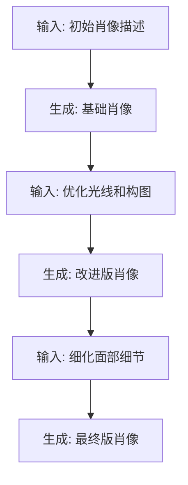
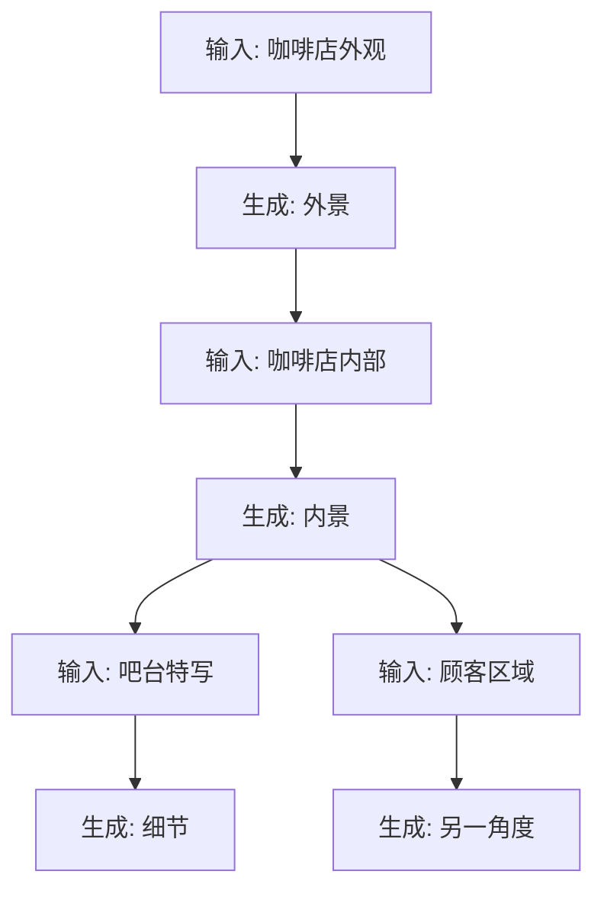
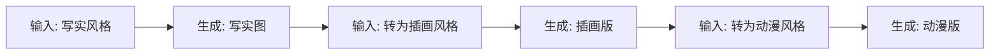
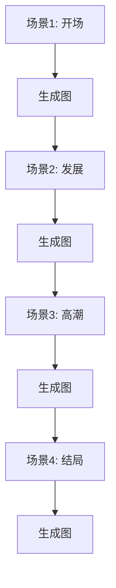

# 链式创作功能使用指南

## 🎯 什么是链式创作？

链式创作是 AI Workflow 的核心功能之一，允许你从任何生成的图片或视频快速创建新的节点继续创作，实现无限迭代优化和扩展创意的工作流程。

## ✨ 核心特性

### 1. 一键继续创作
- 悬停在生成的内容上即可看到"继续创作"按钮
- 点击后自动创建完整的节点组合
- 无需手动连接和配置

### 2. 智能继承设置
- 新节点自动继承当前的模型设置
- 保持相同的宽高比和生成参数
- 确保视觉风格的一致性

### 3. 自动布局优化
- 新节点自动定位在当前节点下方
- 视图自动缩放到新创建的节点
- 保持画布整洁有序

### 4. 无限扩展能力
- 理论上可以无限次继续创作
- 支持复杂的多分支工作流
- 适合长期迭代项目

## 📖 使用方法

### 基础流程

1. **创建初始节点**
   ```
   输入节点 → 图片生成节点
   ```
   - 在输入节点中输入提示词
   - 可选：上传参考图片
   - 配置生成参数

2. **执行生成**
   - 点击图片生成节点的"执行"按钮
   - 等待生成完成
   - 查看生成的图片

3. **继续创作**
   - 将鼠标悬停在生成的图片上
   - 点击出现的"继续创作"按钮
   - 系统自动创建新的节点组合

4. **重复迭代**
   - 在新的输入节点中添加新的提示词
   - 调整生成参数
   - 再次执行，继续优化

### 系统自动完成的操作

当你点击"继续创作"按钮时，系统会：

1. **创建输入节点**
   - 位置：当前节点下方100px
   - 内容：自动包含生成的图片作为参考
   - 文本：空白，等待你添加新的提示词

2. **创建生成节点**
   - 位置：输入节点右侧350px
   - 类型：与当前节点相同（图片→图片，视频→视频）
   - 设置：继承当前节点的所有参数

3. **建立连接**
   - 自动连接输入节点的输出到生成节点的输入
   - 确保数据流正确传递

4. **视图调整**
   - 自动缩放视图以显示新节点
   - 平滑动画过渡（500ms）
   - 选中新创建的节点

## 🎨 实际应用场景

### 场景1：迭代优化肖像照



**步骤**：
1. 初始生成："专业商务肖像，正装，白色背景"
2. 继续创作："增强光线，柔和阴影，更自然的表情"
3. 再次继续："优化皮肤质感，调整色彩平衡"

### 场景2：系列场景创作



**说明**：从同一基础出发，创建多个相关场景，保持视觉一致性。

### 场景3：风格演变



**用途**：同一主题，探索不同艺术风格的表现。

### 场景4：故事板制作



**应用**：创建连续的故事板，每一帧基于前一帧延续。

## 💡 高级技巧

### 1. 多分支探索

从同一张生成的图片创建多个分支：

```
        ┌─→ 版本A：风格1
原图 ──┼─→ 版本B：风格2
        └─→ 版本C：风格3
```

**方法**：
- 对同一张图片多次点击"继续创作"
- 每个分支探索不同的方向
- 最后选择最佳版本

### 2. 参数渐变

逐步调整参数，观察变化：

```
温度0.5 → 温度0.7 → 温度0.9 → 温度1.1
```

**用途**：
- 找到最佳的生成参数
- 理解参数对结果的影响
- 创建渐变效果系列

### 3. 细节放大

从全景到特写：

```
全景 → 中景 → 特写 → 超特写
```

**提示词示例**：
1. "城市街景，繁华商业区"
2. "聚焦街道上的咖啡店"
3. "咖啡店橱窗内的咖啡杯"
4. "咖啡杯的拉花艺术细节"

### 4. 时间序列

创建时间变化序列：

```
清晨 → 正午 → 黄昏 → 夜晚
```

**应用**：
- 展示同一场景的不同时段
- 创建延时效果
- 研究光线变化

## 🚀 最佳实践

### ✅ 推荐做法

1. **渐进式优化**
   - 每次只改变一小部分
   - 便于追踪哪些改变有效
   - 避免一次性大幅修改

2. **保留关键节点**
   - 标记满意的中间结果
   - 可以从任意点重新开始
   - 建立检查点系统

3. **合理布局**
   - 保持工作流的可读性
   - 纵向排列主线
   - 横向展开分支

4. **复用成功设置**
   - 记录好用的参数组合
   - 建立个人模板库
   - 提高创作效率

### ❌ 避免问题

1. **过度迭代**
   - 设定迭代次数上限
   - 防止偏离原始创意
   - 及时决策和结束

2. **分支过多**
   - 控制同时探索的分支数
   - 避免画布过于混乱
   - 定期清理无用节点

3. **忽略性能**
   - 大型工作流可能影响性能
   - 适时保存和重新开始
   - 清理历史节点

## 📊 性能建议

### 画布大小

| 节点数量 | 性能 | 建议 |
|---------|------|------|
| < 20 | 优秀 | 正常使用 |
| 20-50 | 良好 | 可以继续 |
| 50-100 | 一般 | 考虑清理 |
| > 100 | 较慢 | 建议重新开始 |

### 优化建议

1. **定期保存**
   - 重要节点截图保存
   - 导出关键生成内容
   - 记录参数设置

2. **分段创作**
   - 完成一个阶段后重新开始
   - 将上一阶段的最佳结果作为新起点
   - 保持画布清爽

3. **清理无用节点**
   - 删除失败的尝试
   - 保留主要分支
   - 定期整理画布

## 🎓 学习路径

### 初级：基础链式创作
- 完成3-5个节点的简单链
- 熟悉继续创作流程
- 理解参数继承机制

### 中级：多分支探索
- 创建2-3个平行分支
- 比较不同方向的结果
- 学会选择和决策

### 高级：复杂工作流
- 设计10+节点的复杂流程
- 结合多种节点类型
- 实现完整的创作项目

## 🔮 未来功能

即将推出：
- [ ] 节点批注和标记
- [ ] 自动保存工作流历史
- [ ] 工作流模板分享
- [ ] AI辅助的参数推荐
- [ ] 批量继续创作

---

**更新时间**：2025-11-02
**版本**：v28
**功能状态**：✅ 已完成并可用
